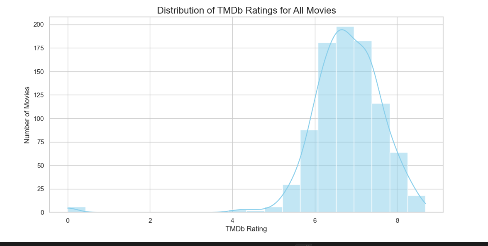

# 🎬 Movie Data Analysis

## 📂 Data Sources

The movie data was obtained from the following sources:

| **Source** | **Details** |
|------------|-------------|
| **CSV** | `Top_1000_Highest_Grossing_Movies_Of_All_Time.csv` – contains titles, release years, box office, duration, MPAA ratings, etc. |
| **TMDb API** | The Movie Database (TMDb) – provides additional metadata like genres, directors, main cast, and TMDb ratings. |

The final dataset is a merged and cleaned version of both sources.

---

## 🗂 Final Dataset Structure

The `df_final` dataset contains the following columns:

| **Column** | **Description** |
|------------|----------------|
| `_id` | Unique identifier (for MongoDB) |
| `title` | Movie title |
| `release_year` | Year of release |
| `genre` | Movie genres |
| `director` | Director(s) |
| `main_cast` | Main cast members |
| `imdb_rating` | IMDb rating |
| `tmdb_rating` | TMDb rating |
| `mpaa_rating` | MPAA rating |
| `duration_minutes` | Duration in minutes |
| `Worldwide_LT_Gross` | Worldwide lifetime gross revenue |
| `Metascore` | Metascore rating |
| `Votes` | Number of IMDb votes |
| `Logline` | Short synopsis |

---

## 🗄 Database Storage

The cleaned dataset was stored in two databases:

**MySQL**  
- Table name: `movies`  
- Good for structured queries, aggregations, and relational operations.

**MongoDB**  
- Collection name: `movies`  
- Suitable for flexible queries on semi-structured data (e.g., genres or cast arrays).

---

## 🔑 Key Features

**Data Cleaning**  
- Handled missing values  
- Converted numeric columns to proper types  
- Standardized categorical columns  

**Exploratory Data Analysis (EDA)**  
- Correlation analysis of numeric columns  
- Visualizations:  
  - Heatmaps of correlation matrices  
  - Distribution plots for ratings and box office gross  
  - Scatter plots and bar charts for key metrics  

**Database Integration**  
- Inserted the final dataset into MySQL using `pandas.to_sql`  
- Inserted the final dataset into MongoDB using `pymongo`  
- Queries can be performed on either database depending on the use case  

---

## 📊 Example Visualizations


**Distribution of TMDb Ratings:**  



---

## 🚀 How to Run

**Clone the repository**  
```bash
git clone https://github.com/yourusername/movie-data-analysis.git
cd movie-data-analysis

